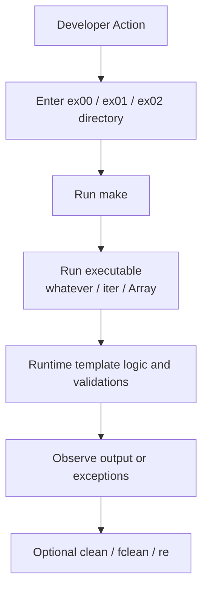

# Developer Documentation (DevDoc)

## Scope

This document explains implementation details for each exercise in `cpp_07`.

## Build Configuration

All exercises use nearly identical Makefiles:

- Compiler: `c++`
- Standard: `C++98`
- Flags: `-Wall -Wextra -Werror`
- Targets: `all`, `clean`, `fclean`, `re`

## ex00 - `whatever.hpp`

### Purpose

Provide generic utility functions through templates:

- `swap(T& a, T& b)`
- `min(const T& a, const T& b)`
- `max(const T& a, const T& b)`

### Behavior Notes

- `swap` exchanges two values using a temporary variable.
- `min` returns the smaller value (`b` when values compare equal due to `a >= b`).
- `max` returns the larger value (`b` when values compare equal due to `a <= b`).

### Test Driver

`ex00/main.cpp` validates behavior with `int` and `std::string`.

## ex01 - `iter.hpp`

### Purpose

Implement a generic iterator-like function:

```cpp
template <typename T>
void iter(T* a, size_t len, void (*function)(T&));
```

### Behavior

- Applies `function` to each element in a raw array.
- Uses pointer increment and length decrement in a loop.
- Works with any type `T` compatible with the callback.

### Test Driver

`ex01/main.cpp` demonstrates multiple callbacks:

- print
- increment
- square
- sum
- reset

over arrays of:

- `int`, `double`, `float`, `char`, `std::string`

## ex02 - `Array<T>`

### Purpose

Provide a minimal custom dynamic array template with safe indexing and deep copy.

### Public Interface

- Default constructor
- Sized constructor: `Array(unsigned int n)`
- Copy constructor
- Assignment operator
- Destructor
- Index operator: `T& operator[](unsigned int index)`
- Size getter: `unsigned int size() const`

### Memory & Copy Semantics

- `Array(unsigned int n)` allocates `n` elements when `n > 0`.
- Copy constructor allocates new memory and copies element-by-element.
- Assignment operator:
  - checks self-assignment
  - releases old memory
  - allocates and copies from source
- Destructor releases allocated memory with `delete[]`.

### Bounds Checking

`operator[]` throws `std::exception` if `index >= _size`.

### Test Driver

`ex02/main.cpp` verifies:

- population of array data
- deep copy through scope test
- value consistency against a raw mirror array
- exception handling on invalid indexes (`-2` and `MAX_VAL`)

## End-to-End Execution Flow (ASCII)

```text
+---------------------------+
|      Developer Action     |
+-------------+-------------+
              |
              v
+---------------------------+
|  Enter ex00/ex01/ex02 dir |
+-------------+-------------+
              |
              v
+---------------------------+
|        make (build)       |
+-------------+-------------+
              |
              v
+---------------------------+
| Run produced executable   |
| whatever / iter / Array   |
+-------------+-------------+
              |
              v
+---------------------------+
|   Runtime template logic  |
|   and validations happen  |
+-------------+-------------+
              |
              v
+---------------------------+
|   Observe output/errors   |
+-------------+-------------+
              |
              v
+---------------------------+
|   clean / fclean / re     |
|     (optional cycle)      |
+---------------------------+
```

## End-to-End Execution Flow (Mermaid, optional)



## Maintenance Notes

- Keep template implementations in headers or included `.tpp` files.
- Preserve C++98 compatibility unless project constraints change.
- If extending `Array<T>`, keep exception and copy behavior consistent.
