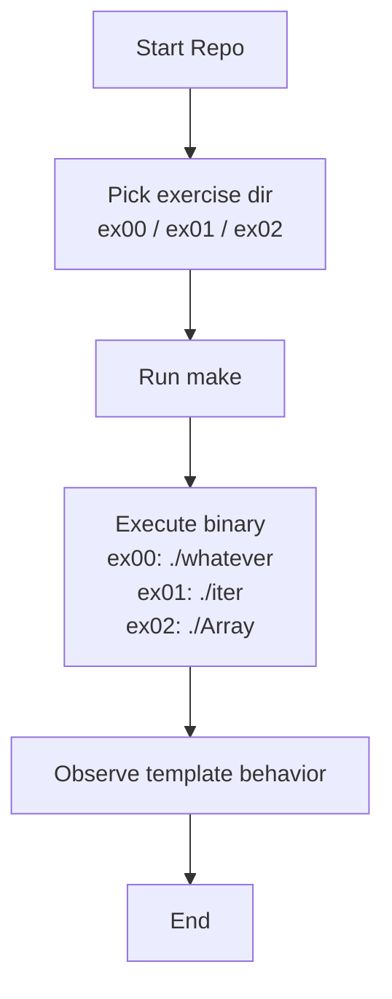

# CPP Module 07 - Templates (42)

This repository contains three exercises from C++ Module 07 focused on templates and generic programming.

## Project Structure

```text
cpp_07/
├── ex00/
│   ├── main.cpp
│   ├── makefile
│   └── whatever.hpp
├── ex01/
│   ├── iter.hpp
│   ├── main.cpp
│   └── makefile
└── ex02/
    ├── Array.hpp
    ├── Array.tpp
    ├── main.cpp
    └── makefile
```

## Requirements

- `c++` compiler compatible with C++98
- `make`
- Linux/macOS shell

All exercises compile with:

- `-Wall`
- `-Wextra`
- `-Werror`
- `-std=c++98`

## Build & Run

### ex00 - `whatever`

```bash
cd ex00
make
./whatever
```

### ex01 - `iter`

```bash
cd ex01
make
./iter
```

### ex02 - `Array`

```bash
cd ex02
make
./Array
```

## What Each Exercise Demonstrates

- **ex00**: Function templates (`swap`, `min`, `max`) on primitive types and `std::string`.
- **ex01**: A generic iterator-like template function applying a callback to array elements.
- **ex02**: A templated dynamic array class with deep copy semantics and bounds checking.

## ASCII Flow (GitHub-friendly)

```text
+-----------------------+
|      Start Repo       |
+-----------+-----------+
            |
            v
+-----------------------+
|   Pick exercise dir   |
|   (ex00/ex01/ex02)    |
+-----------+-----------+
            |
            v
+-----------------------+
|        Run make       |
+-----------+-----------+
            |
            v
+-----------------------+
|   Execute binary      |
| ex00 -> ./whatever    |
| ex01 -> ./iter        |
| ex02 -> ./Array       |
+-----------+-----------+
            |
            v
+-----------------------+
|  Observe template     |
|      behavior         |
+-----------+-----------+
            |
            v
+-----------------------+
|          End          |
+-----------------------+
```

## Mermaid Flow (optional)



## Cleaning Targets

From any exercise directory:

```bash
make clean   # remove object files
make fclean  # remove object files + binary
make re      # full rebuild
```

## Notes

- `ex02` throws `std::exception` on out-of-range access in `operator[]`.
- The implementation is intentionally simple and follows the module constraints.
