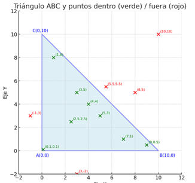

# Introducción: El Objetivo del Proyecto

Robust design of custom data types using the Orthodox Canonical Form (OCF) and operator overloading. The core of this project involved implementing 'Fixed'(fixed-point), and 'Point' classes, creating a foundation for clean and efficient Object-Oriented-Programming (OOP).


## Components of OCF (The rule of Three or Four)

To follow the OCF (Orthodox Canonical Form) in C++, you must define these four components to ensure proper resource management:

- `Default Constructor (Optional): Initializes an object without specific parameters.`
- `Copy Constructor.`
- `Copy Assignment Operator.`
- `Destructor.`


## Exercise 00: The Orthodoxe Canonical Form (OCF)

The OCF is the cornerstone of OPP in c++. It prevents unexpected behavior when classes are copied, assigned or destroyed. avoiding memory leaks or shallow copies.

### Implementation 

- `The default constructor(optional): Initializes an object without specific parameters, initializing its attributes to a known state(such as zero or null).`
- `The copy constructor: Creates a bit-for-bit copy from an existing object, preventing the sharing of resources.`
- `Copy Assignment Operator: Copies the values from one existing object to another existing object.`
- `Destructor: Cleans up resources (such as memory) when the object is destroyed.`

### Diagram ASCII: Class OCF (Ex. 00)
#### Code fragment
```
graph TD
    A[Base class  (e.g., "ClapTrap")] ->|Default ctor| B{New object}
    A ->|Copy ctor| C{New object + Cloned data}
    A ->|Operator =| D{Existing object + Updated}The main challenge was creating a custom data type (Fixed),
    A ->|Destructor| E[Free resources (LIFO)]
```
 
## Exercise 01: Class Fixed (Fixed Point)

The main challenge was creating a custom data type (Fixed). To simulated floating-pint precision while treating them as integers using fixed scaling factor.

### Implementation

- `Fixed(int) Initialization: Multiplies the value by scaling factor (n<<8).`
- `Fixed(float) Initialization: Multiplies the value by 256 and handles the rounding by adding or subtracting 0.5 (+ 0.5 / - 0.5).`
- `toFloat() Conversion: Division by scaling factor (a/256).`
- `toInt() Conversion: Shift bits (a>>8).`
- `Stream isertion Operator(<<): Overloaded to display the human-readable value of the object.`

#### Code fragment
```
graph TD
    A[Float Value (e.g., 10.10)] -->|Scale: x256 + Rounding| B[Raw Integer Bits (e.g., 2586)]
    B -->|getRawBits| C(Internal Storage)
    C -->|toFloat: /256.0| D[Converted Float (e.g., 10.1016)] 
```

### Exercise 02: Complete operator overloading

In this exercise, we transform Fixed into a fully functional data type by giving it arithmetic capabilities, comparison operators, and pointer manipulation.

### Implementation

| `Operator types | `Functions implemented, challenge` | `solution` |
| :--- | :---: | :---: |
| `Comparison (<, >, ==, !=, <=, >=.)` | Implement six Const operators | Direct comparison of the internal Raw Bits (this->getRawBits() > other.getRawBits()) |
| `Arithmetic (+, -, *, /)` | Implement four const operators | The multiplication and division require rescaling to maintain accuracy ((a⋅b)≫8 and (a⋅256)/b) |
| `Increase and decrease (++, --)` | Implement four operators(pre/post). | Prefix: Increment and returns *this. Postfix: Saves a copy, increments or decrements 'a', and return the copy |
| `Statics (min, max)` | Implement four functions (2 const, 2 non-const) | Returns a reference to the min or max object by using the overloaded comparison operators. |


#### Code fragment
```
graph TD
    A[Fixed a, Fixed b] ->|operator*| B(long long a.a * b.a)
    B ->|Rescale (>> 8)| C[Fixed Result]
```
 
## Exercise 03: Geometry and  bsp (Point in triangle)

For the final exercise, we will apply the Fixed class to a geometry problem to prove it can handle complex calculations like area triangulation and point-in-polygon tests."

### Implementation

| `Class function` | Key implementation |
| :--- | :---: |
| `Class point` | OCF with attributes, Fixed const x, y. All constructors use the Member initialization list. The = operator return *this without assigment |
| `Auxiliary function (signedArea)` | Calculate the area with its sign using the cross product formula. (P1.x - P3.x).(P2.y - P3.y)- based completely on Fixed::operator- and Fixed::operator*. |
| `Function bsp` | Call signedArea function three times. Returns TRUE only if the three results have the same sign (all_positive or all negative). |

#### Code fragment
```
graph TD
    A[main.cpp] -->|Call| B(bsp(A, B, C, P))
    B -->|Llamada 1| C{signedArea(A, B, P)}
    B -->|Llamada 2| D{signedArea(B, C, P)}
    B -->|Llamada 3| E{signedArea(C, A, P)}
    C -->|Fixed * Fixed| F(Evaluation of Sign)
    D --> F
    E --> F
    F -->|Sign Consistent| G{Return TRUE / FALSE}

```

Base test cases for the implementation.

```

•  A(0,0)A(0, 0)A(0,0)
•  B(10,0)B(10, 0)B(10,0)
•  C(0,10)C(0, 10)C(0,10)

   10 |             C(0,10)
      |            *
    9 |           *
    8 |          *
    7 |         *
    6 |        *
    5 |       *
    4 |      *
    3 |     *
    2 |    *
    1 |   *
    0 |A *----------* B(10,0)
      +----------------------------
        0   1   2   3 ...       10
```
Points located inside the triangle.
```y el recto
Point (x, y)	A quick sanity check.
(2.5, 2.5)	2.5 ≤ -2.5+10 → 2.5 ≤ 7.5	Inside
(4, 4)	4 ≤ -4+10 → 4 ≤ 6	Inside
(3, 5)	5 ≤ -3+10 → 5 ≤ 7	Inside
(5, 3)	3 ≤ -5+10 → 3 ≤ 5	Inside
(1, 8)	8 ≤ -1+10 → 8 ≤ 9	Inside
(7, 1)	1 ≤ -7+10 → 1 ≤ 3	Inside
(9, 0.5)	0.5 ≤ -9+10 → 0.5 ≤ 1	Inside
(0.1, 0.1)	0.1 ≤ -0.1+10 → 0.1 ≤ 9.9	Inside
```
All these ponts are inside of the triangle or on the edges if they satisfy the equation.

Some point outside to comparison
```
Point (x, y)	A quick sanity check.
(5.5, 5.5)	5.5 ≤ 4.5	Outside
(8, 5)	5 ≤ 2	Outside
(10, 10)	10 ≤ 0	Outside
(−1, 3)	x < 0	Outside
(3, −2)	y < 0	Outside
```
#### Summary:
The triangle corresponds to the region bounded by the X-axis, the Y-axis, and the line $y = -x + 10$. Any point with positive coordinates that is strictly below that line is inside.

 
